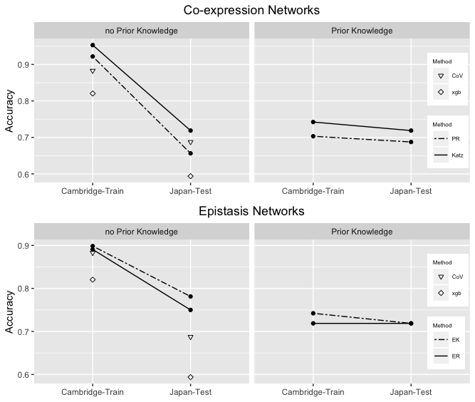

# PriorKnowledgeEpistasisRank
Epistasis network centralities that incorporate prior knowledge
Author: Saeid Parvandeh and Brett McKinney

### How to install required packages
    > install.packages("gdata")
    > library(gdata)
    > install.packages("devtools", repos="http://cran.r-project.org")
    > require(devtools)
    > install_github("insilico/privateEC")
    > library(privateEC)
    > install.packages("lattice")
    > library(lattice)
    > install.packages("caret", repos="http://cran.r-project.org")
    > library(caret)
    > install.packages("glmnet", repos="http://cran.r-project.org")
    > library(glmnet)
    > install.packages("CORElearn", repos="http://cran.r-project.org")
    > library(CORElearn)
    > install.packages("xgboost", repos="http://cran.r-project.org")
    > library(xgboost)

### How to find vignettes
You will be able to find two vignettes, pathway.Rmd and classification.Rmd. The first one manifests the steps of creating pathaway enrichment and how prior knowledge improve Reactome Pathways for MDD, and the second shows the classification accuracies where we add prior knowledge. 

### Accuracy plot
Prior knowledge effect of epistasis centrality on training accuracy (Cambridge data on left) and independent validation accuracy (Japan data on right). Accuracies of four different centrality-based feature selection methods with prior knowledge (PK) and without prior knowledge (no PK) using nested cross-validated classification with xgboosted trees. Centralities include PageRank (PR), Katz, Epistasis Katz (EK), EpistasisRank (ER). We compare the accuracy with no prior knowledge and coefficient of variation (CoV) filtering (triangles) and xgboost only on all genes (diamonds).

