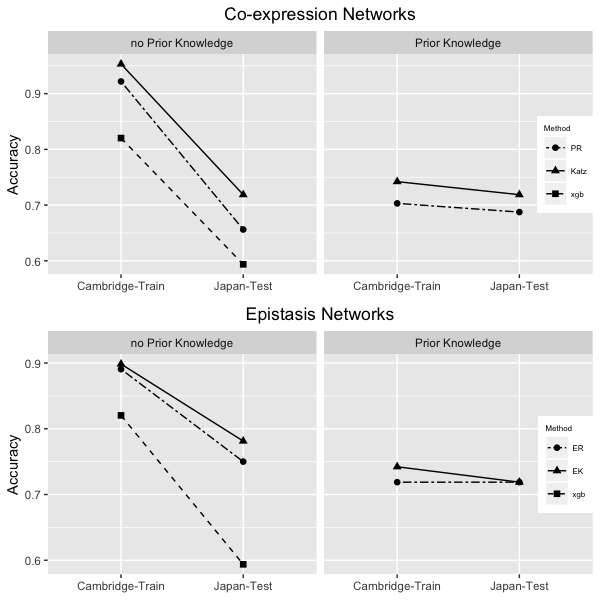

# PriorKnowledgeEpistasisRank
Epistasis network centralities that incorporate prior knowledge
Author: Saeid Parvandeh and Brett McKinney

### How to install required packages
[https://github.com/insilico/PriorKnowledgeEpistasisRank/blob/master/R%20Scripts/install_dependencies.R](Install Script)
    
### How to find vignettes
There are two vignettes, pathway.Rmd and classification.Rmd. The first one shows the steps of creating pathaway enrichment and how prior knowledge improves Reactome Pathway enrichment for MDD, and the second shows the effect on nested-CV classification accuracies of gene-wise prior knowledge in network centrality algorithms. 

### Accuracy plot
Training accuracy (Cambridge data) and independent validation accuracy (Japan data) with centrality feature selection without prior knowledge (left panels) and with prior knowledge (right panels). Top: co-expression net-work centrality feature selection methods, PageRank (PR) and Katz. Bottom row: expression-epistasis network centrality methods, EpistasisRank (ER) and EpistasisKatz (EK). Accuracies computed by xgboosted trees with nested cross-validation. Xgboost accuracies without feature selection also shown (squares).

