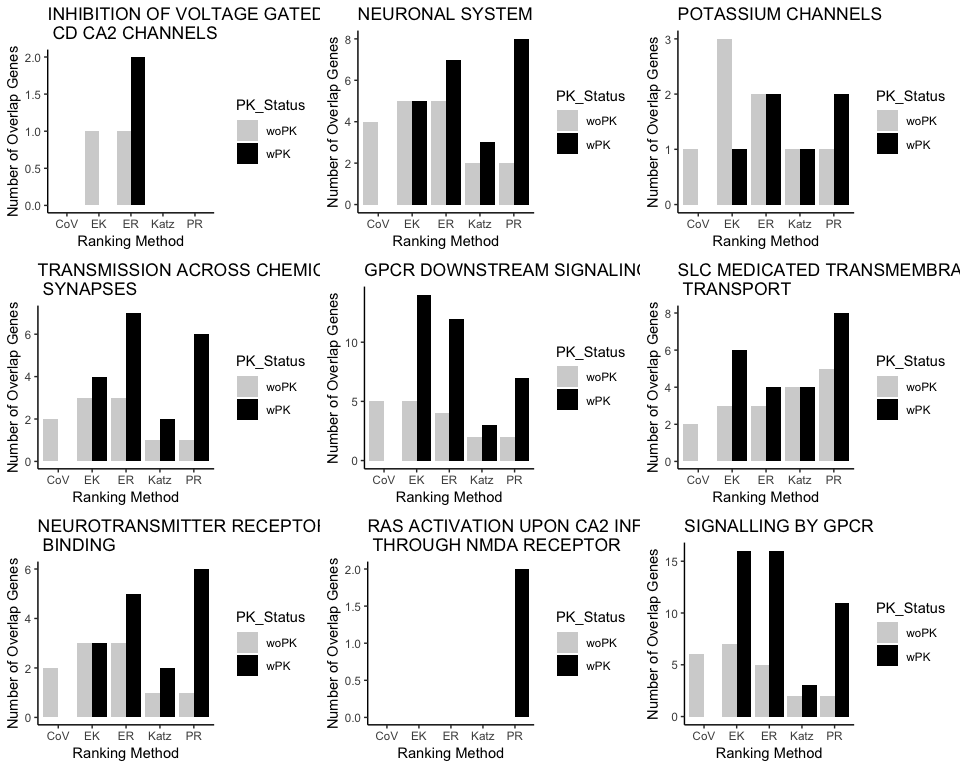

Classification (with and without prior knowledge) Example
================
Saeid Parvandeh
10/14/2018

``` r
knitr::opts_chunk$set(echo = TRUE, warning=FALSE)
knitr::opts_knit$set(root.dir = "~/Documents/PhD papers/PK/Original")
```

### Install required packages

``` r
check.packages <- function(pkg){
  # check.packages function: install and load multiple R packages.
  # Check to see if packages are installed. Install them if they are not, 
  # then load them into the R session.
  # https://gist.github.com/smithdanielle/9913897
  
  new.pkg <- pkg[!(pkg %in% installed.packages()[, "Package"])]
  if (length(new.pkg)) 
    install.packages(new.pkg, repos = "http://cran.us.r-project.org", dependencies = TRUE)
  sapply(pkg, require, character.only = TRUE)
}


if (!("privateEC" %in% installed.packages()[,"Package"])){
  devtools::install_github("insilico/privateEC", build_vignettes = TRUE)
}
library(privateEC)

if (!("devtools" %in% installed.packages()[,"Package"])){
  install.packages("devtools", repos = "http://cran.us.r-project.org", dependencies = TRUE)
}
library(devtools)

# install github package
if (!("Rinbix" %in% installed.packages()[,"Package"])){
  devtools::install_github("insilico/Rinbix", build_vignettes = TRUE)
}

# install cran packages
packages <- c("ggplot2", "CORElearn", "gridExtra", "lattice", "caret", "glmnet", "xgboost", "igraph",
              "gdata", "SDMtools", "RMariaDB")

# # install bioconductor packages
# source("https://bioconductor.org/biocLite.R")
# biocLite("GEOquery")
# biocLite("Biobase")
# biocLite("preprocessCore")

source("impquery-functions.R")
```

### Loading data from GEO website

``` r
# # get data from GEO
# Elist <- getGEO("GSE98793")
# 
# # Elicit gene expression
# expr <- exprs(Elist[[1]])
# # Elicit the titles (MDD and CON)
# titles <- pData(Elist[[1]])[, 1]
# # assign the status labels
# camb_class <- ifelse(grepl("control", titles), 0, 1)
# # Making sure that probIDs and rownames are identical
# probID <- Elist$GSE98793_series_matrix.txt.gz@featureData@data$ID
# identical(as.character(probID), rownames(expr))
# # Substitute probID with gene symboles
# gene.symbol <- Elist$GSE98793_series_matrix.txt.gz@featureData@data$`Gene Symbol`
# rownames(expr) <- gene.symbol
# expr <- expr[-which(rownames(expr)==""), ]
# 
# # z-transformation on control samples
# ctrl_idx <- which(camb_class==0)
# ctrl_expr <- expr[, ctrl_idx]
# z.trans_mat <- matrix(0,nrow = nrow(expr),ncol=ncol(expr))
# for (i in 1:nrow(ctrl_expr)){
#   z.trans_mat[i, ] <- pnorm(as.numeric(expr[i, ]),
#                             mean(as.numeric(ctrl_expr[i, ])),
#                             sd(as.numeric(ctrl_expr[i, ])))
# }
# 
# camb_expr <- t(z.trans_mat)
# colnames(camb_expr) <- rownames(expr)
# rownames(camb_expr) <- colnames(expr)
# 
# save(camb_expr, file = "camb_expr.RData")
# save(camb_class, file = "camb_class.RData")

# # get data from GEO
# Elist <- getGEO("GSE76826")
# 
# # Elicit gene expression
# expr <- exprs(Elist[[1]])
# # Elicit the titles (MDD and HC)
# titles <- pData(Elist[[1]])[, 1]
# # assign the status labels
# jap_class <- ifelse(grepl("HC", titles), 0, 1)
# # Making sure that probIDs and rownames are identical
# probID <- Elist$GSE76826_series_matrix.txt.gz@featureData@data$ID
# identical(as.character(probID), rownames(expr))
# # Substitute probID with gene symboles
# gene.symbol <- Elist$GSE76826_series_matrix.txt.gz@featureData@data$GENE_SYMBOL
# rownames(expr) <- gene.symbol
# expr <- expr[-which(rownames(expr)==""), ]
# 
# # z-transform in control samples
# ctrl_idx <- which(jap_class==0)
# ctrl_expr <- expr[, ctrl_idx]
# z.trans_mat <- matrix(0,nrow = nrow(expr),ncol=ncol(expr))
# for (i in 1:nrow(ctrl_expr)){
#   z.trans_mat[i, ] <- pnorm(as.numeric(expr[i, ]),
#                             mean(as.numeric(ctrl_expr[i, ])),
#                             sd(as.numeric(ctrl_expr[i, ])))
# }
# 
# jap_expr <- t(z.trans_mat)
# colnames(jap_expr) <- rownames(expr)
# rownames(jap_expr) <- colnames(expr)
# 
# save(jap_expr, file = "jap_expr.RData")
# save(jap_class, file = "jap_class.RData")
load("jap_class.RData")
```

### Subsampling

``` r
# # balance the number of case/control subjects.
# case_idx <- which(camb_class==1)
# set.seed(123)
# half_case_idx <- sample(case_idx, length(case_idx)/2)
# camb_class <- camb_class[-half_case_idx]
# camb_expr <- camb_expr[-half_case_idx, ]
# save(camb_expr, file = "camb_expr_equalized.RData")
# save(camb_class, file = "camb_class_equalized.RData")
# load("camb_expr_equalized.RData")
load("camb_class_equalized.RData")
```

### Filter noisy genes using coefficient of variation

``` r
# # Coefficient of Variation (CoV) filtering -- Cambridge, Japan
# exprData1 <- t(camb_expr)
# camb_expr.fltr_cov <- data.frame(t(cov.filter(exprData1,.559095)$fdata)) 
# dim(camb_expr.fltr_cov)
# 
# exprData2 <- t(jap_expr)
# jap_expr.fltr_cov <- data.frame(t(cov.filter(exprData2,.559095)$fdata)) 
# dim(jap_expr.fltr_cov)
# 
# camb_genes <- as.character(colnames(camb_expr.fltr_cov))
# jap_genes <- as.character(colnames(jap_expr.fltr_cov))
# 
# common_genes <- intersect(camb_genes, jap_genes)
# length(common_genes)
# camb_fltr.expr <- camb_expr.fltr_cov[, which(camb_genes %in% common_genes)]
# camb_fltr.expr <- camb_fltr.expr[, order(colnames(camb_fltr.expr))]
# dim(camb_fltr.expr)
# save(camb_fltr.expr, file = "camb_fltr.expr.RData")
load("camb_fltr.expr.RData")
# jap_fltr.expr <- jap_expr.fltr_cov[, which(jap_genes %in% common_genes)]
# jap_fltr.expr <- jap_fltr.expr[, order(colnames(jap_fltr.expr))]
# dim(jap_fltr.expr)
# save(jap_fltr.expr, file = "jap_fltr.expr.RData")
load("jap_fltr.expr.RData")
```

### Computing the IMP query network

``` r
# # wirte all genes in a file
# write.matrix(colnames(camb_fltr.expr), file = "top5000uniq-genes.txt", sep = "\t")
# geneListFile <- "top5000uniq-genes.txt"
# outPrefix <-    "top5000uniq-genes"
# 
# cat("Gene list file:      ", geneListFile, "\n", sep = "\t")
# cat("Confidence threshold:", confidenceThreshold, "\n", sep = "\t")
# cat("Target network size: ", targetListSize, "\n", sep = "\t")
# cat("Output prefix:       ", outPrefix, "\n", sep = "\t")
# 
# # read the list of input genes
# cat("Reading gene list (network node) file\n")
# geneListTable <- read.table(geneListFile, header = FALSE, sep = "\t",
#                             stringsAsFactors = FALSE)
# numInputGenes <- nrow(geneListTable)
# inputGeneList <- as.character(geneListTable[, 1])
# # TODO: lists with main effects would have have scores here in column 2
# inputScoresList <- rep.int(x = 0, times = numInputGenes)
# cat(length(inputGeneList), " genes read \n")
# 
# # connect to the MySQL database
# cat("Opening a connection to the database\n")
# cursorImpDatabase <- RMariaDB::dbConnect(MariaDB(),
#                                          user = "anonymous",
#                                          password = "s3cr3t",
#                                          dbname = "imp",
#                                          host = "127.0.0.1")
# 
# # create the interactions matrix, optionally expanding the list first with IMP interactions
# cat("Building the matrix from database queries\n")
# hasMainEffects <- FALSE
# isRankedList <- FALSE
# outSifFilename <- paste(outPrefix, ".sif", sep = "")
# VERBOSE_FLAG <- FALSE
# confidenceThreshold <- 0  # confidence range 0.0 to 1.0
# targetListSize = 0 # use only original list
# matrixGeneList = fillRegain(cursorImp = cursorImpDatabase,
#                             geneList = inputGeneList,
#                             scoreList = inputScoresList,
#                             hasMainEffectScores = hasMainEffects,
#                             ranked = isRankedList,
#                             confidenceThreshold = confidenceThreshold,
#                             addMode = FALSE,
#                             sifFilename = outSifFilename,
#                             verbose = VERBOSE_FLAG)
# 
# # write output files
# # matrix
# outFilename <- paste(outPrefix, ".adjmat", sep = "")
# cat("Saving", outFilename, "\n")
# colnames(matrixGeneList$filledMatrix) <- matrixGeneList$filledGeneList
# write.table(matrixGeneList$filledMatrix, file = outFilename, sep = "\t",
#             col.names = TRUE, row.names = FALSE, quote = FALSE)
# 
# impNetwork <- as.matrix(read.table("top5000uniq-genes.adjmat", header = TRUE, sep = "\t"))
# # replace all real values with 1, so that we will have a binary matrix
# impNetwork[impNetwork > 0] <- 1
# impNetwork <- matrix(as.integer(impNetwork), nrow = 5000)
# rownames(impNetwork) <- colnames(camb_fltr.expr)
# colnames(impNetwork) <- colnames(camb_fltr.expr)
# save(impNetwork, file = "impNetwork.RData")

load("impNetwork.RData")
```

#### Create prior knowledge network

``` r
# prior knowledge
impgraph <- igraph::graph_from_adjacency_matrix(impNetwork, mode = "undirected", diag = TRUE, add.rownames = NA)
IMP_deg <- igraph::degree(impgraph, normalized = TRUE, loops = FALSE)
```

### Computing the reGAIN matrix

``` r
# # Cambridge
# camb_data <- data.frame(camb_fltr.expr, class = camb_class)
# camb_reGAIN <- Rinbix::regainInbix(camb_data)$reGAIN
# save(camb_reGAIN, file = "camb_reGAIN.RData")
load("camb_reGAIN.RData")
# # Japan
# jap_data <- data.frame(jap_fltr.expr, class = jap_class)
# jap_reGAIN <- Rinbix::regainInbix(jap_data)$reGAIN
# save(jap_reGAIN, file = "jap_reGAIN.RData")
load("jap_reGAIN.RData")
```

### Centrality methods without prior knowledge

#### PageRank

``` r
# camb_expre.cor <- cor(camb_fltr.expr)
# # co-expression to binary
# camb_Adj <- ifelse(abs(camb_expre.cor) > .15, 1, 0)
# diag(camb_Adj) <- 0
# 
# # Adjacency matrix to graph
# camb_Adj_g <- igraph::graph.adjacency(camb_Adj)
# # page_woPKRank centrality
# camb_page_woPK <- Rinbix::PageRank(camb_Adj_g)$vector
# camb_page_woPK.sort <- sort(camb_page_woPK, T)
# 
# top_camb_page_woPK <- camb_page_woPK.sort[1:200]
# save(top_camb_page_woPK, file = "top_camb_page_woPK.RData")
load("top_camb_page_woPK.RData")
```

#### Katz

``` r
# a <- eigen(camb_Adj)
# beta <- rep(1, nrow(camb_Adj))/nrow(camb_Adj)
# alpha <- 1/max(a$values) - (1/max(a$values))/100
# camb_katz_woPK <- Rinbix::EpistasisKatz(camb_Adj, alpha, beta)
# names(camb_katz_woPK) <- colnames(camb_Adj)
# camb_katz_woPK.sort <- sort(camb_katz_woPK, T)
# 
# top_camb_katz_woPK <- camb_katz_woPK.sort[1:200]
# save(top_camb_katz_woPK, file = "top_camb_katz_woPK.RData")
load("top_camb_katz_woPK.RData")
```

#### EpistasisKatz

``` r
# alpha <- 1/mean(colSums(camb_reGAIN))
# beta <- diag(camb_reGAIN)
# camb_regain.Katz <- camb_reGAIN
# diag(camb_regain.Katz) <- 0
# camb_EK_woPK <- Rinbix::EpistasisKatz(camb_regain.Katz, alpha, beta)
# names(camb_EK_woPK) <- rownames(camb_reGAIN) 
# camb_EK_woPK.sort <- sort(camb_EK_woPK, T)
# 
# top_camb_EK_woPK <- camb_EK_woPK.sort[1:200]
# save(top_camb_EK_woPK, file = "top_camb_EK_woPK.RData")
load("top_camb_EK_woPK.RData")
```

#### EpistasisRank

``` r
# camb_ER_woPK <- Rinbix::EpistasisRank(camb_reGAIN, Gamma_vec = .85)
# top_camb_ER_woPK <- camb_ER_woPK[1:200, ]
# save(top_camb_ER_woPK, file = "top_camb_ER_woPK.RData")
load("top_camb_ER_woPK.RData")
```

#### Coefficient of Variation (cov) filtering

``` r
# exprData <- t(camb_fltr.expr)
# top_camb_cov <- t(Rinbix::geneLowCoefOfVarFilter(exprData,.4874)$fdata) # 200 genes
# save(top_camb_cov, file = "top_camb_cov.RData")
load("top_camb_cov.RData")
```

### Centrality method with prior knowledge

#### PageRank

``` r
# camb_page_wPK <- as.numeric(Rinbix::PageRank(camb_Adj, IMP_deg))
# names(camb_page_wPK) <- rownames(camb_Adj) 
# camb_page_wPK.sort <- sort(camb_page_wPK, T)
# top_camb_page_wPK <- camb_page_wPK.sort[1:200]
# save(top_camb_page_wPK, file = "top_camb_page_wPK.RData")
load("top_camb_page_wPK.RData")
```

#### Katz

``` r
# alpha <- 1/max(a$values) - (1/max(a$values))/100
# camb_katz_wPK <- Rinbix::EpistasisKatz(camb_Adj, alpha, beta = IMP_deg)
# names(camb_katz_wPK) <- rownames(camb_Adj) 
# camb_katz_wPK.sort <- sort(camb_katz_wPK, T)
# top_camb_katz_wPK <- camb_katz_wPK.sort[1:200]
# save(top_camb_katz_wPK, file = "top_camb_katz_wPK.RData")
load("top_camb_katz_wPK.RData")
```

#### EpistasisKatz

``` r
# beta <- diag(camb_reGAIN)
# camb_regain.Katz <- camb_reGAIN
# diag(camb_regain.Katz) <- 0
# camb_ekatz_wPK <- Rinbix::EpistasisKatz(camb_regain.Katz, IMP_deg, beta)
# names(camb_ekatz_wPK) <- rownames(camb_Adj) 
# camb_ekatz_wPK.sort <- sort(camb_ekatz_wPK, T)
# top_camb_EK_wPK <- camb_ekatz_wPK.sort[1:200]
# save(top_camb_EK_wPK, file = "top_camb_EK_wPK.RData")
load("top_camb_EK_wPK.RData")
```

#### EpistasisRank

``` r
# camb_ER_wPK <- Rinbix::EpistasisRank(camb_reGAIN, IMP_deg)
# top_camb_ER_wPK <- camb_ER_wPK[1:200, ]
# save(top_camb_ER_wPK, file = "top_camb_ER_wPK.RData")
load("top_camb_ER_wPK.RData")
```

### Pathway Plots

``` r
pathways <- read.csv("Reactome_pathways.csv", header = TRUE)

my_pathways_woPK <- cbind(names(top_camb_page_woPK), names(top_camb_katz_woPK), 
                          names(top_camb_EK_woPK), as.character(top_camb_ER_woPK$gene), colnames(top_camb_cov))
colnames(my_pathways_woPK) <- c("Page_woPK", "Katz_woPK", "EK_woPK", "ER_woPK", "CoV")
save(my_pathways_woPK, file = "my_pathways_woPK.RData")
pathway_mat_woPK <- matrix(0, 5, 9)
for (i in 1:5){
  for (j in 1:9){
    pathway_mat_woPK[i, j] <- length(intersect(my_pathways_woPK[, i], as.character(pathways[, j])))
  }
}

my_pathways_wPK <- cbind(names(top_camb_page_wPK), names(top_camb_katz_wPK), 
                         names(top_camb_EK_wPK), as.character(top_camb_ER_wPK$gene))

colnames(my_pathways_wPK) <- c("Page_wPK", "Katz_wPK", "EK_wPK", "ER_wPK")
save(my_pathways_wPK, file = "my_pathways_wPK.RData")
pathway_mat_wPK <- matrix(0, 5, 9)
for (i in 1:4){
  for (j in 1:9){
    pathway_mat_wPK[i, j] <- length(intersect(my_pathways_wPK[, i], as.character(pathways[, j])))
  }
}

plot_df <- data.frame(PK_Status=c("woPK", "woPK", "woPK", "woPK", "woPK", "wPK", "wPK", "wPK", "wPK", "wPK"), 
                      Method=c("PR", "Katz", "EK", "ER", "CoV", "PR", "Katz", "EK", "ER", "CoV"), 
                      rbind(pathway_mat_woPK, pathway_mat_wPK))

p1 <- ggplot2::ggplot(data=plot_df, ggplot2::aes(x=Method, y=X1, fill=PK_Status)) +
  ggplot2::labs(title="INHIBITION OF VOLTAGE GATED \n CD CA2 CHANNELS", x="Ranking Method", y = "Number of Overlap Genes")+
  ggplot2::theme(axis.title = ggplot2::element_text(size = .5)) +
  ggplot2::geom_bar(stat="identity", position=ggplot2::position_dodge()) +
  ggplot2::scale_fill_brewer(palette="Paired") + ggplot2::theme_minimal() +
  ggplot2::scale_fill_manual(values=c("lightgray", "black")) +
  ggplot2::theme_classic()
```

    ## Scale for 'fill' is already present. Adding another scale for 'fill',
    ## which will replace the existing scale.

``` r
p2 <- ggplot2::ggplot(data=plot_df, ggplot2::aes(x=Method, y=X2, fill=PK_Status)) +
  ggplot2::labs(title="NEURONAL SYSTEM", x="Ranking Method", y = "Number of Overlap Genes")+
  ggplot2::theme(axis.title = ggplot2::element_text(size = .5)) +
  ggplot2::geom_bar(stat="identity", position=ggplot2::position_dodge()) +
  ggplot2::scale_fill_brewer(palette="Paired") + ggplot2::theme_minimal() +
  ggplot2::scale_fill_manual(values=c("lightgray", "black")) +
  ggplot2::theme_classic()
```

    ## Scale for 'fill' is already present. Adding another scale for 'fill',
    ## which will replace the existing scale.

``` r
p3 <- ggplot2::ggplot(data=plot_df, ggplot2::aes(x=Method, y=X3, fill=PK_Status)) +
  ggplot2::labs(title="POTASSIUM CHANNELS", x="Ranking Method", y = "Number of Overlap Genes")+
  ggplot2::theme(axis.title = ggplot2::element_text(size = .5)) +
  ggplot2::geom_bar(stat="identity", position=ggplot2::position_dodge()) +
  ggplot2::scale_fill_brewer(palette="Paired") + ggplot2::theme_minimal() +
  ggplot2::scale_fill_manual(values=c("lightgray", "black")) +
  ggplot2::theme_classic()
```

    ## Scale for 'fill' is already present. Adding another scale for 'fill',
    ## which will replace the existing scale.

``` r
p4 <- ggplot2::ggplot(data=plot_df, ggplot2::aes(x=Method, y=X4, fill=PK_Status)) +
  ggplot2::labs(title="TRANSMISSION ACROSS CHEMICAL \n SYNAPSES", x="Ranking Method", y = "Number of Overlap Genes")+
  ggplot2::theme(axis.title = ggplot2::element_text(size = .5)) +
  ggplot2::geom_bar(stat="identity", position=ggplot2::position_dodge()) +
  ggplot2::scale_fill_brewer(palette="Paired") + ggplot2::theme_minimal() +
  ggplot2::scale_fill_manual(values=c("lightgray", "black")) +
  ggplot2::theme_classic()
```

    ## Scale for 'fill' is already present. Adding another scale for 'fill',
    ## which will replace the existing scale.

``` r
p5 <- ggplot2::ggplot(data=plot_df, ggplot2::aes(x=Method, y=X5, fill=PK_Status)) +
  ggplot2::labs(title="GPCR DOWNSTREAM SIGNALING", x="Ranking Method", y = "Number of Overlap Genes")+
  ggplot2::theme(axis.title = ggplot2::element_text(size = .5)) +
  ggplot2::geom_bar(stat="identity", position=ggplot2::position_dodge()) +
  ggplot2::scale_fill_brewer(palette="Paired") + ggplot2::theme_minimal() +
  ggplot2::scale_fill_manual(values=c("lightgray", "black")) +
  ggplot2::theme_classic()
```

    ## Scale for 'fill' is already present. Adding another scale for 'fill',
    ## which will replace the existing scale.

``` r
p6 <- ggplot2::ggplot(data=plot_df, ggplot2::aes(x=Method, y=X6, fill=PK_Status)) +
  ggplot2::labs(title="SLC MEDICATED TRANSMEMBRANCE \n TRANSPORT", x="Ranking Method", y = "Number of Overlap Genes")+
  ggplot2::theme(axis.title = ggplot2::element_text(size = .5)) +
  ggplot2::geom_bar(stat="identity", position=ggplot2::position_dodge()) +
  ggplot2::scale_fill_brewer(palette="Paired") + ggplot2::theme_minimal() +
  ggplot2::scale_fill_manual(values=c("lightgray", "black")) +
  ggplot2::theme_classic()
```

    ## Scale for 'fill' is already present. Adding another scale for 'fill',
    ## which will replace the existing scale.

``` r
p7 <- ggplot2::ggplot(data=plot_df, ggplot2::aes(x=Method, y=X7, fill=PK_Status)) +
  ggplot2::labs(title="NEUROTRANSMITTER RECEPTOR \n BINDING", x="Ranking Method", y = "Number of Overlap Genes")+
  ggplot2::theme(axis.title = ggplot2::element_text(size = .5)) +
  ggplot2::geom_bar(stat="identity", position=ggplot2::position_dodge()) +
  ggplot2::scale_fill_brewer(palette="Paired") + ggplot2::theme_minimal() +
  ggplot2::scale_fill_manual(values=c("lightgray", "black")) +
  ggplot2::theme_classic()
```

    ## Scale for 'fill' is already present. Adding another scale for 'fill',
    ## which will replace the existing scale.

``` r
p8 <- ggplot2::ggplot(data=plot_df, ggplot2::aes(x=Method, y=X8, fill=PK_Status)) +
  ggplot2::labs(title="RAS ACTIVATION UPON CA2 INFLUX \n THROUGH NMDA RECEPTOR", x="Ranking Method", y = "Number of Overlap Genes")+
  ggplot2::theme(axis.title = ggplot2::element_text(size = .5)) +
  ggplot2::geom_bar(stat="identity", position=ggplot2::position_dodge()) +
  ggplot2::scale_fill_brewer(palette="Paired") + ggplot2::theme_minimal() +
  ggplot2::scale_fill_manual(values=c("lightgray", "black")) +
  ggplot2::theme_classic()
```

    ## Scale for 'fill' is already present. Adding another scale for 'fill',
    ## which will replace the existing scale.

``` r
p9 <- ggplot2::ggplot(data=plot_df, ggplot2::aes(x=Method, y=X9, fill=PK_Status)) +
  ggplot2::labs(title ="SIGNALLING BY GPCR", x="Ranking Method", y = "Number of Overlap Genes")+
  ggplot2::theme(plot.title = ggplot2::element_text(size = .2)) +
  ggplot2::geom_bar(stat="identity", position=ggplot2::position_dodge()) +
  ggplot2::scale_fill_brewer(palette="Paired") + ggplot2::theme_minimal() +
  ggplot2::scale_fill_manual(values=c("lightgray", "black")) +
  ggplot2::theme_classic()
```

    ## Scale for 'fill' is already present. Adding another scale for 'fill',
    ## which will replace the existing scale.

``` r
gridExtra::grid.arrange(p1, p2, p3, p4, p5, p6, p7, p8, p9, nrow = 3, ncol = 3)
```


